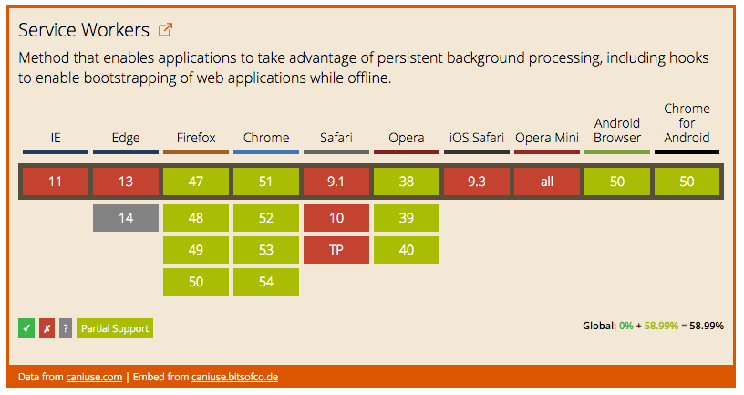

# Awesome Service Workers 📡

> A curated list of useful resources for Service Workers

> Service Workers are the backbone for creating [offline-first](http://offlinefirst.org/) applications. They sit, conceptually, between the network and the document, giving them the ability to intercept the network requests and provide content for documents, even while offline.

Inspired by the [awesome](https://github.com/sindresorhus/awesome) list thing.

## Table of Contents

- Specification
- Support & Polyfill
- How Tos
- Articles
- Videos
- Talks
- Tools
- Showcase
- [Contributing](CONTRIBUTING.md)
- Licence


## Specification

The problem of offline -

> Web Applications traditionally assume that the network is reachable ... HTML documents are loaded over HTTP and traditionally fetch all of their sub-resources via subsequent HTTP requests. This places web content at a disadvantage versus other technology stacks.

The solution -

> The service worker is designed first to redress this balance by providing a Web Worker context, which can be started by a runtime when navigations are about to occur. This event-driven worker is registered against an origin and a path (or pattern), meaning it can be consulted when navigations occur to that location. **Events that correspond to network requests are dispatched to the worker and the responses generated by the worker may over-ride default network stack behavior**. This puts the service worker, conceptually, between the network and a document renderer, allowing the service worker to provide content for documents, even while offline.

[W3C Specification](http://www.w3.org/TR/service-workers/)


## Support

[  ](http://caniuse.com/#feat=serviceworkers)

*Last updated 7th July 2016*

For up-to-date details on support see -

- [Is Service Worker Ready?](https://jakearchibald.github.io/isserviceworkerready/)
- [caniuse.com](http://caniuse.com/#feat=serviceworkers)

## Polyfills

- Here


## The API

### Register a Service Worker

```javascript
if ('serviceWorker' in navigator) {
  navigator.serviceWorker.register('/sw.js', { scope: './' }).then(function(reg) {
    // registration worked
    console.log('Registration succeeded', reg);
  }).catch(function(err) {
    // registration failed
    console.log('Registration failed', err);
  });
}
```


### Service Worker Events

Event | Description
------|--------------
`install` | Dispatched when the service worker's installing worker changes
`activate` | Dispatched when the service worker's active worker changes
`fetch` | Dispatched when the document attempts a network (fetch) request
`message` | Dispatched when the service worker receives a message, e.g. from the main document via the postMessage API

*[See W3C Spec](https://www.w3.org/TR/service-workers/#execution-context-events)*


## Articles

- [Introduction to Service Worker](http://www.html5rocks.com/en/tutorials/service-worker/introduction/) by Matt Guant (1st December 2014)
- [Using Service Workers](https://developer.mozilla.org/en-US/docs/Web/API/Service_Worker_API/Using_Service_Workers) by MDN
- [Service Workers Explained](https://github.com/slightlyoff/ServiceWorker/blob/master/explainer.md) by slightlyoff
- [Getting Started with Service Workers](https://www.sitepoint.com/getting-started-with-service-workers/) by Ritesh Kumar (19th November 2015)


## Videos

- [How to Setup a Basic Service Worker (with Caching)](https://www.youtube.com/watch?v=BfL3pprhnms) by Ire Aderinokun (9th May 2016)


## Talks


- [Progressive Web Apps Summit 2016 (Full Playlist)](https://www.youtube.com/playlist?list=PLNYkxOF6rcIAWWNR_Q6eLPhsyx6VvYjVb)


## Tools

- [Service Worker Toolbox](https://github.com/GoogleChrome/sw-toolbox)
- [Lighthouse](https://github.com/GoogleChrome/lighthouse)


## Showcase

- 
- 


## Licence

Licensed under the [Creative Commons CC0 License](https://creativecommons.org/publicdomain/zero/1.0/).


