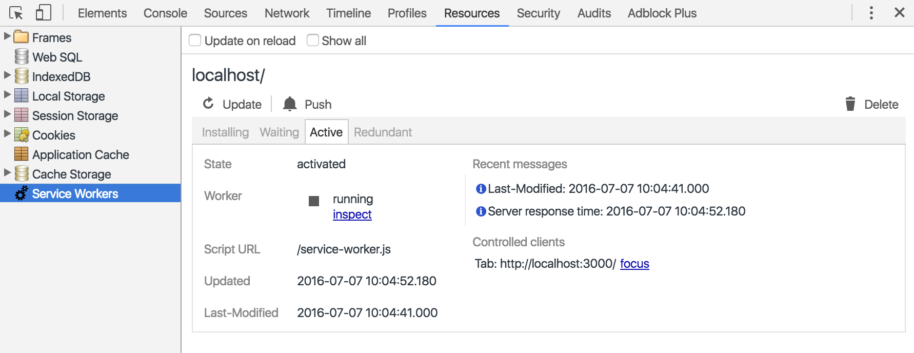

# Awesome Service Worker 📡

> A curated list of useful resources for Service Worker

> Service Workers are the backbone for creating [offline-first](http://offlinefirst.org/) applications. They sit, conceptually, between the network and the document, giving them the ability to intercept the network requests and provide content for documents, even while offline.

Inspired by the [awesome](https://github.com/sindresorhus/awesome) list thing.

## Table of Contents

- [Specification](#specification)
- [Support](#support)
- [The API](#the-api)
    - [Registering a Service Worker](#registering-a-service-worker)
    - [The Service Worker Lifecycle](#the-service-worker-lifecycle)
    - [Service Worker Events](#service-worker-events)
- [Articles](articles)
- [Videos](#videos)
- [Talks](#talks)
- [Tools](#tools)
    - [Chrome Dev Tools](#chrome-dev-tools)
- [Showcase](#showcase)
- [Contributing](CONTRIBUTING.md)
- [Licence](#licence)


## Specification

[W3C Specification](http://www.w3.org/TR/service-workers/) -


> Web Applications traditionally assume that the network is reachable ... HTML documents are loaded over HTTP and traditionally fetch all of their sub-resources via subsequent HTTP requests. **This places web content at a disadvantage versus other technology stacks**.

> The service worker is designed first to redress this balance by providing a Web Worker context, which can be started by a runtime when navigations are about to occur. This event-driven worker is registered against an origin and a path (or pattern), meaning it can be consulted when navigations occur to that location. **Events that correspond to network requests are dispatched to the worker and the responses generated by the worker may over-ride default network stack behavior**. This puts the service worker, conceptually, between the network and a document renderer, **allowing the service worker to provide content for documents, even while offline**.


## Support


&nbsp;        | Chrome | Firefox | Safari | IE  | Edge | Opera | Opera Mini | Android Browser
---------------|--------|---------|--------|-----|------|-------|------------|----
Service Worker | ✅*    | ✅*      | ❌     | ❌ | ❌   | ✅*    | ❌         | ✅* 
Promises       | ✅     | ✅      | ✅    | ❌  | ✅   | ✅    | ❌        | ✅ 


Not full support yet | *Last updated 7th July 2016*

For up-to-date details on support see -

- [Is Service Worker Ready?](https://jakearchibald.github.io/isserviceworkerready/)
- [Can I Use](http://caniuse.com/#feat=serviceworkers)


## The API

### Registering a Service Worker

Assuming the Service Worker file (called `service-worker.js`) is located in the root directory.

```javascript
if ('serviceWorker' in navigator) {
  navigator.serviceWorker.register("/service-worker.js")
    .then(function(registration) {
      console.log('Registration succeeded!', registration);
    })
    .catch(function(err) {
      console.log('Registration failed!', err);
    });
}
```

*[See W3C Spec](https://www.w3.org/TR/service-workers/#document-context)*

### The Service Worker Lifecycle

The Service Worker can be in one of the following states.

State | Description
------|-------------
Parsed | The Service Worker is downloaded and aprsed when the user first visits the page
Installing | If the parsed file is new (or a different version of a previous file), installation is attempted
Installed / Waiting | The Service Worker is installed and waiting to be activated
Activating | The Service Worker is in the process of being activated
Activated | The Service Worker is considered the active worker and has control of the document
Redundant | When a new Service Worker has taken control of the page, the previous one is held as redundant

*[See W3C Spec](https://www.w3.org/TR/service-workers/#service-worker-state)*


### Service Worker Events

The Service Worker is event driven. There are four events it can listen for.

Event | Description
------|--------------
`install` | Dispatched when the service worker's installing worker changes
`activate` | Dispatched when the service worker's active worker changes
`fetch` | Dispatched when the document attempts a network (fetch) request
`message` | Dispatched when the service worker receives a message, e.g. from the main document via the postMessage API

*[See W3C Spec](https://www.w3.org/TR/service-workers/#execution-context-events)*


## Articles

- [Introduction to Service Worker](http://www.html5rocks.com/en/tutorials/service-worker/introduction/) by Matt Guant (1st December 2014)
- [Using Service Workers](https://developer.mozilla.org/en-US/docs/Web/API/Service_Worker_API/Using_Service_Workers) by MDN
- [Service Workers Explained](https://github.com/slightlyoff/ServiceWorker/blob/master/explainer.md) by slightlyoff
- [Getting Started with Service Workers](https://www.sitepoint.com/getting-started-with-service-workers/) by Ritesh Kumar (19th November 2015)
- [Making a Service Worker](https://www.smashingmagazine.com/2016/02/making-a-service-worker/) by Lyza Danger Gardner on SitePoint (1st February 2016)
- [The Offline Cookbook](https://jakearchibald.com/2014/offline-cookbook/) by Jake Archibald (9th December 2014)


## Videos

- [How to Setup a Basic Service Worker (with Caching)](https://www.youtube.com/watch?v=BfL3pprhnms) by Ire Aderinokun (9th May 2016)


## Talks


- [Progressive Web Apps Summit 2016 (Full Playlist)](https://www.youtube.com/playlist?list=PLNYkxOF6rcIAWWNR_Q6eLPhsyx6VvYjVb)


## Tools

- [Service Worker Toolbox](https://github.com/GoogleChrome/sw-toolbox)
- [Lighthouse](https://github.com/GoogleChrome/lighthouse)


### Chrome Dev Tools


The Service Worker for the current page can be viewed at **Resources > Service Workers**



You can also go to `chrome://serviceworker-internals/` to see all registered Service Workers


## Showcase

- **Service Worker Example Scripts** ( [Source](https://github.com/lyzadanger/serviceworker-example) ) - Various examples of things you can do with Service Workers (for example, precache, fetch handling, and versioning). 


## Licence

Licensed under the [Creative Commons CC0 License](https://creativecommons.org/publicdomain/zero/1.0/).


